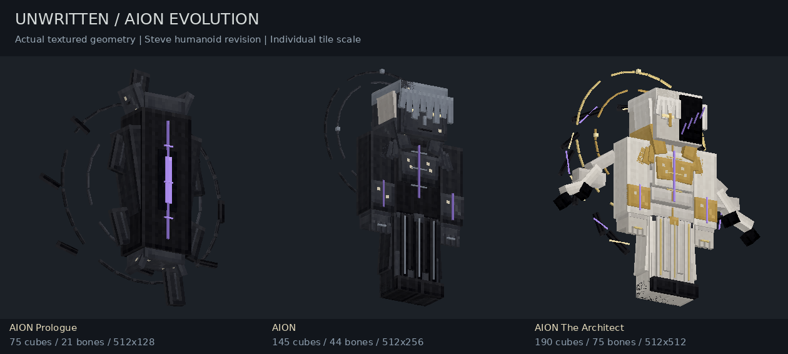
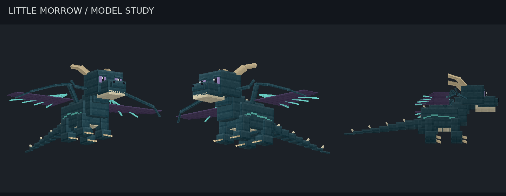
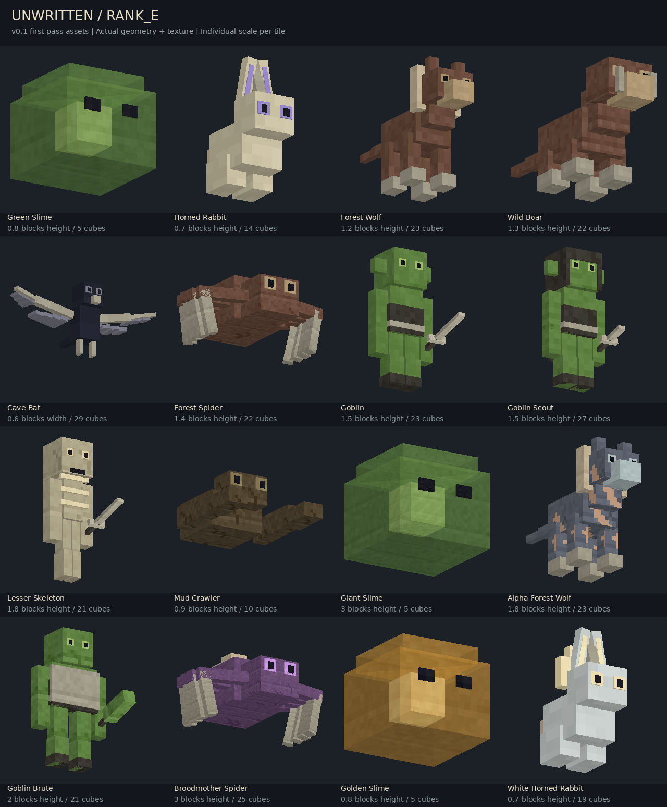
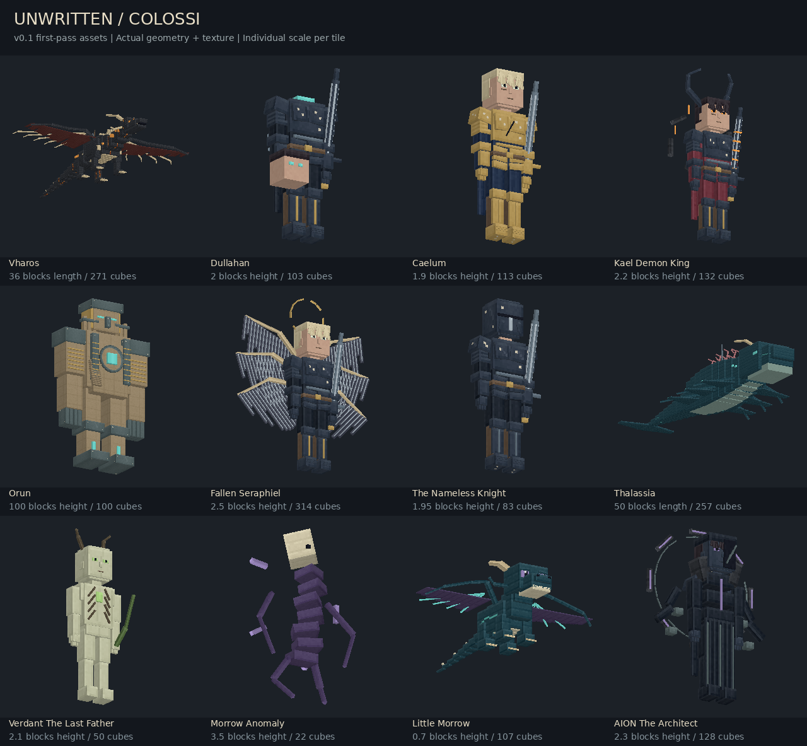
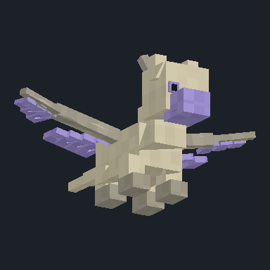

# UNWRITTEN

**Fantasy Persistent RPG for Minecraft Bedrock**

> The world remembers the players.

## Creature assets v0.2: Ten Colossi art pass

The 20 principal Colossus forms and supporting characters have been rebuilt with
dedicated sculpture recipes, articulated limbs, unique padded UV islands and
material-specific pixel textures. The other 277 assets remain first-pass models.

AION now begins as a faceless, unstable **black orb**, then appears as a dark
humanoid. His Architect form retains the dark identity with separated torso pieces,
extra arms and suspended fragments. Little Morrow has his own short-snouted,
midnight-blue dragon anatomy, pale horns, violet eyes and compact membrane wings.

These are editable art-pass assets, not a claim of final high-end certification.
Bedrock-device performance, actual application import and final art approval are
still required. See [Colossus art notes](docs/COLOSSI_ART.md).





## Base roster

297 editable first-pass assets covering the supplied monster roster, all Colossus
presentation forms, pets, seven prologue weapons, supporting NPCs and quest props.
Non-Colossus assets are **first_pass**, not finished bespoke art or a playable RPG. Many
models share body recipes and animation curves. Clip count is not a count of
independently choreographed animations.

| Path | Contents |
| :--- | :--- |
| `blockbench/` | Editable models with embedded textures and numeric keyframes |
| `packs/UNWRITTEN_RP/` | Bedrock geometry, PNG, animations, client entities, controllers |
| `packs/UNWRITTEN_Preview_BP/` | Optional stationary preview entities, no combat or natural spawning |
| `dist/UNWRITTEN_Assets.mcpack` | Packaged resource pack |
| `dist/UNWRITTEN_Preview.mcpack` | Packaged preview behavior pack |
| `catalog/assets.json` | Asset paths, sizes, design tags, bone counts, clips and status |
| `catalog/roster.txt` | Source roster |
| `docs/CANON.md` | Latest Era I canon summary |
| `docs/PRODUCTION.md` | Integration boundaries and unfinished bespoke work |
| `docs/previews/` | Actual textured model renders and animation GIFs |
| `tools/` | Builder, structural validator and CPU preview renderer |

## Open in Blockbench

1. Use **Code → Download ZIP** and extract the repository.
2. Open a `.bbmodel` from `blockbench/` in Blockbench.
3. Textures are embedded; select **Animate** to inspect keyframes.

Start with `blockbench/rank_e/green_slime.bbmodel`,
`blockbench/rank_e/goblin.bbmodel`, or `blockbench/colossi/little_morrow.bbmodel`.
Sources use Bedrock entity format, named bones and per-face UVs.

## Preview in Bedrock

Import both `.mcpack` files and enable both packs in a separate test world with
cheats. They are asset-review entities, not combat monsters.

```mcfunction
/summon unwritten:green_slime ~ ~ ~
/playanimation @e[type=unwritten:green_slime,c=1] animation.unwritten.green_slime.hop
/summon unwritten:little_morrow ~ ~ ~
/playanimation @e[type=unwritten:little_morrow,c=1] animation.unwritten.little_morrow.curious_head_tilt
```

Remove previews with `/kill @e[family=unwritten_preview]`. Large models require clear
space. Orun is a visual reference, not climbable terrain. Preview entities have
small collision boxes, disabled gravity and collision, and automatic idle clips.
Manual animation may blend with idle; this is not a production phase controller.

A custom server must register matching `unwritten:*` entity identifiers and send
the resource pack to clients. These files do not implement Dragonfly registration
or establish behavior-pack compatibility with that engine.

## Rebuild and validation

```bash
python -m pip install -r requirements.txt
python tools/build_assets.py
python tools/build_colossi.py
python tools/validate_assets.py
python tools/render_previews.py
python tools/render_colossi.py
```

Building overwrites generated files. Protect hand edits in `source_overrides/`,
including matching geometry, PNG and animation exports. Identifiers, texture seeds
and ZIP metadata are deterministic. All art is original code-defined cuboids and
pixel patterns; no third-party character texture is bundled.

Structural checks cover every asset, UV bounds, skeleton references, keyframes,
embedded textures, client wiring and ZIP parity. CPU previews inspect representative
models. **Actual Blockbench application import and Bedrock in-game testing have
not been performed in this environment.** Bright pixels are not emissive rendering;
VFX and bespoke encounter animations remain unfinished.







Pack wiring references Microsoft's [Creating New Entity Types](https://learn.microsoft.com/en-us/minecraft/creator/documents/introductiontoaddentity?view=minecraft-bedrock-stable)
and [Client Entity documentation](https://learn.microsoft.com/en-us/minecraft/creator/reference/content/entityreference/examples/cliententitydocumentation/cliententitydocumentationintroduction?view=minecraft-bedrock-stable).
