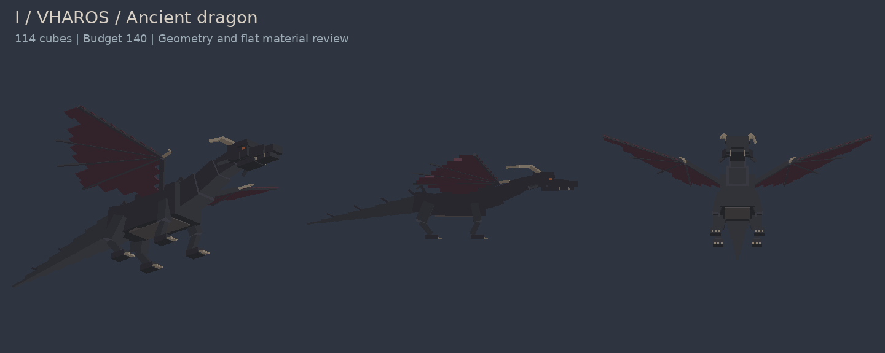

# Ten Colossi model studio

Current focus: **I. Vharos**, one model at a time. This directory is the new geometry review track. Older resource-pack assets are not the result of this revision.

[Open editable Vharos model](vharos/vharos.bbmodel) | [Geometry JSON](vharos/vharos.geo.json) | [Measured model report](vharos/review.json)

The gray materials are neutral preview swatches only. Final textures, UV painting, animations, weapons and runtime integration are deferred. Embedded weapons are deliberately omitted too. The preview is rendered from the exported cube geometry, not generated concept art.

Vharos has one dragon form. The current revision replaces the 474-cube plated sculpture with 114 cubes, about 76% fewer. It uses a low forward-reaching neck, three connected torso masses, four bent legs, thin connected wing webs, eight tail links, a tapered jaw, sparse dorsal spines, backward horns and a broken left horn. A 140-cube build gate prevents detail inflation. Length remains 38 blocks, measured from transformed geometry; the revised stance is lower than the previous 18.6-block sculpt.

The visual direction is closer to Minecraft dragon mods such as [Dragon Mounts](https://github.com/MWall541/Dragon-Mounts-Legacy): simple anatomical masses and broad wing surfaces. No model or texture from that mod is copied. This remains an original cube-based Bedrock geometry model, not a smooth polygon mesh. The absence of final textures makes its underlying cuboid construction visible.

Future humanoid models will retain Steve/player body proportions with modeled hair, clothing and accessories. Thalassia remains a whale; Verdant has tree and player forms; the other model revisions are still pending. No other Colossus is marked complete by this Vharos pass.

Validation covers positive cube dimensions, named bone references, absence of weapons/animation clips, export parsing and software-rendered views. Actual Blockbench application review and in-game performance are still pending. These are inspectable working models, not certified final production assets.
