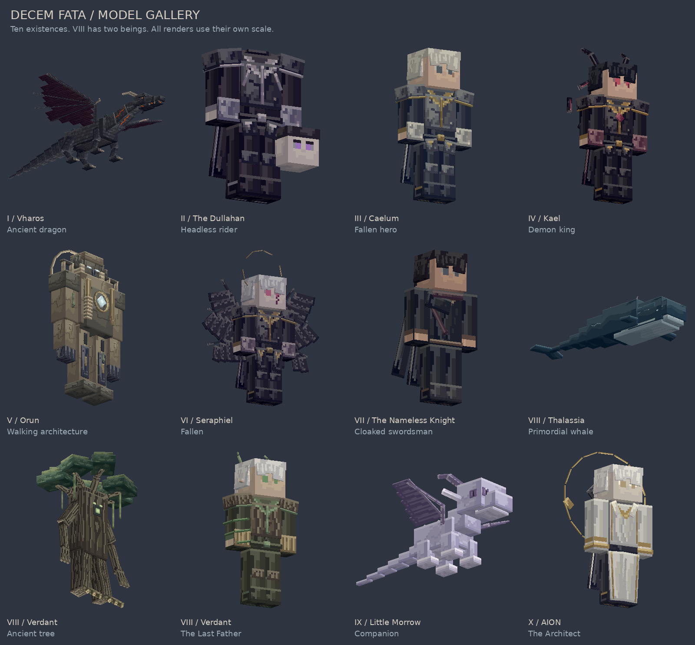

# Ten Colossi: model review

All ten Colossi and their forms now follow the simplified Vharos approach. Twenty editable models include Dullahan's horse and Elara. Original pixel-art textures now replace flat material swatches: stepped shading, readable faces, cloth folds, metal bevels, scales and material-specific detail.

[All 20 forms](previews/all_forms.png) | [Download model bundle](Ten_Colossi_Models.zip) | [Validation and dimensions](catalog.json)

Humanoids retain the six Steve body parts, uniformly sized to a 1.8-block body. Hair, clothing, armor, wings and rings are separate geometry. Dullahan omits the attached head; Architect separates parts while retaining their proportions. Accessories can extend beyond body height.

| Colossus | Form | Cubes | Model | Preview |
|---|---|---:|---|---|
| I: Vharos | Ancient dragon | 114 / 140 | [Blockbench](vharos/vharos.bbmodel) | [Three views](vharos/preview.png) |
| II: The Dullahan | Headless rider | 34 / 65 | [Blockbench](dullahan/dullahan.bbmodel) | [Three views](dullahan/preview.png) |
| II: Dullahan Horse | Spectral horse | 24 / 50 | [Blockbench](dullahan_horse/dullahan_horse.bbmodel) | [Three views](dullahan_horse/preview.png) |
| III: Caelum | Fallen hero | 39 / 70 | [Blockbench](caelum/caelum.bbmodel) | [Three views](caelum/preview.png) |
| III: Elara | Supporting spirit | 32 / 55 | [Blockbench](elara_spirit/elara_spirit.bbmodel) | [Three views](elara_spirit/preview.png) |
| IV: Kael | Hunter | 26 / 60 | [Blockbench](kael_hunter/kael_hunter.bbmodel) | [Three views](kael_hunter/preview.png) |
| IV: Kael | Demon king | 54 / 90 | [Blockbench](kael_demon_king/kael_demon_king.bbmodel) | [Three views](kael_demon_king/preview.png) |
| V: Orun | Walking architecture | 93 / 130 | [Blockbench](orun/orun.bbmodel) | [Three views](orun/preview.png) |
| VI: Seraphiel | Angel | 85 / 120 | [Blockbench](sir_seraphiel/sir_seraphiel.bbmodel) | [Three views](sir_seraphiel/preview.png) |
| VI: Seraphiel | Fallen | 78 / 120 | [Blockbench](fallen_seraphiel/fallen_seraphiel.bbmodel) | [Three views](fallen_seraphiel/preview.png) |
| VII: The Nameless Knight | Cloaked swordsman | 26 / 60 | [Blockbench](the_nameless_knight/the_nameless_knight.bbmodel) | [Three views](the_nameless_knight/preview.png) |
| VIII: Thalassia | Primordial whale | 36 / 65 | [Blockbench](thalassia/thalassia.bbmodel) | [Three views](thalassia/preview.png) |
| VIII: Verdant | Ancient tree | 57 / 95 | [Blockbench](verdant_giant/verdant_giant.bbmodel) | [Three views](verdant_giant/preview.png) |
| VIII: Verdant | The Last Father | 43 / 90 | [Blockbench](verdant_the_last_father/verdant_the_last_father.bbmodel) | [Three views](verdant_the_last_father/preview.png) |
| IX: Morrow | Anomaly | 35 / 80 | [Blockbench](morrow_anomaly/morrow_anomaly.bbmodel) | [Three views](morrow_anomaly/preview.png) |
| IX: Little Morrow | Companion | 53 / 85 | [Blockbench](little_morrow/little_morrow.bbmodel) | [Three views](little_morrow/preview.png) |
| IX: True Morrow | The Unwritten Dragon | 103 / 140 | [Blockbench](true_morrow/true_morrow.bbmodel) | [Three views](true_morrow/preview.png) |
| X: ??? | Prologue presence | 12 / 25 | [Blockbench](aion_prologue/aion_prologue.bbmodel) | [Three views](aion_prologue/preview.png) |
| X: AION | The Architect | 51 / 105 | [Blockbench](aion/aion.bbmodel) | [Three views](aion/preview.png) |
| X: AION | Authority unbound | 60 / 110 | [Blockbench](aion_the_architect/aion_the_architect.bbmodel) | [Three views](aion_the_architect/preview.png) |

## Scope and validation

The current model revision lives in `model_studio/`. Previous runtime packs and animation sources are unchanged and are not this revision. No weapons are present. Each texture.png is an original painted atlas with unique padded face islands, embedded in its Blockbench model. Painting is generated from authored pixel-art rules and character palettes, with no reference-image pixels or downloaded assets. This is an art revision, not a claim of final quality approval. Animation authoring remains deferred.

Export parsing, cube budgets, positive dimensions, bone parent references, Steve proportions, six Seraphiel wings, no weapon groups and zero animation clips are checked during build. Renders come from actual exported geometry. Blockbench application import and Bedrock runtime testing remain pending.

Orun remains a visual model, not a climbable structure or a completed modular encounter. Different preview tiles use different scale. Read `catalog.json` for dimensions.

The painted palette preserves each identity: pearl/black Seraphiel, pale Little Morrow, an ocean-blue whale and ivory/gold AION. No horror effects or body gore are added.
